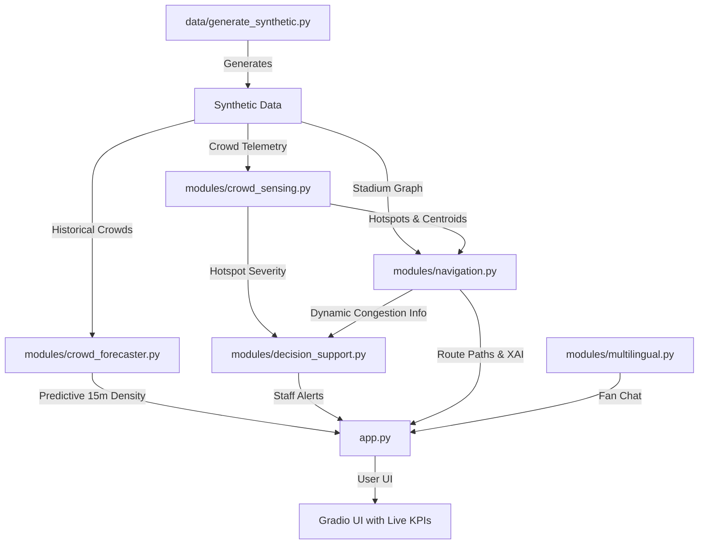

# ⚽ StadiumSense AI — GenAI Command Center for FIFA World Cup 2026

[](https://python.org)
[](https://gradio.app)
[](https://deepmind.google/technologies/gemini/)
[](#-testing)
[](https://huggingface.co/spaces/manasahegde/StadiumSense-AI)
[](#-license)

> **StadiumSense AI** is a GenAI-enabled predictive venue operations command center and fan wayfinding platform built for the FIFA World Cup 2026. Fusing real-time spatial clustering, machine learning forecasting, graph-based routing, and generative AI, it optimizes matchday flows, detours fans around concourse emergencies, and delivers structured briefings to stadium stewards.

---

## 🌐 Live Deployment & Walkthrough
* **Gradio App Live Link**: [**▶ Launch Live Dashboard on Hugging Face**](https://huggingface.co/spaces/manasahegde/StadiumSense-AI)
---

## 📖 Project Overview

### The Problem
During massive events like the FIFA World Cup 2026, managing the flow of 80,000+ fans inside a stadium concourse presents critical challenges:
* **Reactive Operations**: Crowd bottlenecks and security incidents are typically identified *after* they occur, leading to long queues and safety hazards.
* **Complex Spatial Topologies**: Stadium concourses contain multiple seating sections, concessions, medical hubs, and exits. Finding the optimal route is non-trivial when certain walkways are congested.
* **Language Barriers**: Supporters arrive from all over the world, requiring instant, multilingual assistance.
* **Information Silos**: Command centers, stewards, and fans operate on separate communication channels, delaying response times.

### The Solution: StadiumSense AI
StadiumSense AI integrates all of these requirements into a single, unified, AI-driven operations platform:
1. **Dynamic Crowd Sensing**: Applies density-based spatial clustering (**DBSCAN**) on sensor telemetry to locate and measure current bottlenecks.
2. **Predictive Analytics**: Uses a **Random Forest Regressor** trained on matchday historical records to predict crowd densities 15 minutes in advance, enabling proactive crowd-control interventions.
3. **Graph-Based Wayfinding**: Uses **NetworkX Dijkstra** pathfinding to dynamically penalize paths crossing active hotspots, rerouting fans and stewards safely.
4. **GenAI Rationale & Explanations**: Integrates Google Gemini (`gemini-1.5-flash`) to describe paths, translate messages, and compile structured dispatch briefings using the standard *Situation-Action-Reason-Priority-Impact* operations framework.

---

## ✨ Key Features

* 🏃 **Smart Indoor Navigation**: Dynamic Dijkstra shortest path routing across seating blocks, gates, restrooms, food concessions, and exits. Automatically detours around high/medium crowd hotspots.
* 📊 **Crowd Hotspot Detection**: Real-time DBSCAN spatial clustering over coordinate sensor feeds, grouping ambient fan densities and identifying centroids.
* 🔮 **Predictive Crowd Forecasting**: Machine learning forecast engine predicting future zone density values in 15 minutes using a Random Forest model trained on game-phase features.
* 🚨 **Incident Simulator**: Dropdown panel allowing operators to simulate concourse emergencies (e.g. *Gate B Closed*, *Concourse Concession Fire near Sec_104*, *Medical Emergency*, *Severe Rainstorm*) and watch the entire network and pathing engine adapt.
* 🔮 **Explainable AI (XAI)**: Detailed panel displaying the specific routing strategy, detour rationales, and the AI decision confidence score.
* 📢 **Decision Support Engine**: Compiles raw warnings into structural operations dispatch instructions formatted for radio briefings.
* 💬 **Multilingual Fan Assistant**: Fan chat interface supporting instant question answering. Automatically detects languages and responds in kind, with local offline keyword fallbacks.
* 🛡️ **Security-First Design**: Implements prompt-injection pattern blocking, character length limits, and strict schema validation.
* ♿ **Accessibility-Focused UI**: High-contrast, clean UI using Gradio v6's Soft theme, responsive CSS layout, and semantic markup tags.
* 📈 **Live KPI Dashboard**: Header panel tracking estimated fans inside, average gate queues, threat levels, gate flow balance, and AI dispatches in real time.

---

## 📐 System Architecture

The platform follows a modular, pipeline-driven design:



---

## 🔄 Operations Workflow

```mermaid
flowchart LR
    A[Fan / Operator Request] --> B[Navigation Engine]
    B --> C[Fetch Congested Hotspots]
    C --> D[DBSCAN Clustering + RF Forecast]
    D --> E[Penalize Congested Graph Edges]
    E --> F[Dijkstra Path Solver]
    F --> G[Explainable AI Rationale Engine]
    G --> H[Gemini / Local Fallback Translation]
    H --> I[Gradio Map & Structured Response]
```



---

## 🗂️ Folder Structure

The repository maintains a clean, separation-of-concerns layout:

```text
StadiumSense-AI/
├── .github/
│   └── workflows/
│       └── tests.yml          # GitHub Actions CI Workflow
├── data/
│   ├── generate_synthetic.py  # Telemetry & historical data generator
│   ├── stadium_graph.json     # Graph geometry layout
│   ├── crowd_telemetry.csv    # Current crowd points CSV
│   └── crowd_historical.csv   # Historical ML training data CSV
├── modules/
│   ├── __init__.py            # Package initializer
│   ├── navigation.py          # NetworkX Dijkstra routing solver
│   ├── crowd_sensing.py       # DBSCAN clustering algorithm
│   ├── crowd_forecaster.py    # Random Forest regression forecasting model
│   ├── multilingual.py        # Gemini language translation/assistant
│   ├── decision_support.py    # Alerts generator and briefing formatting
│   └── security_utils.py      # Input validation & prompt-injection filters
├── tests/
│   ├── __init__.py            # Package initializer
│   ├── test_navigation.py     # Pathfinding & detour unit tests
│   ├── test_crowd_sensing.py  # DBSCAN & incident simulation unit tests
│   ├── test_crowd_forecaster.py # RandomForest fit & forecast validation
│   ├── test_decision_support.py # Operational alerts unit tests
│   └── test_multilingual.py   # Chatbot translation & injection tests
├── app.py                     # Gradio dashboard web interface
├── conftest.py                # pytest path setup file
├── pytest.ini                 # Pytest warning suppression filters
├── requirements.txt           # Python dependency requirements
├── .gitignore                 # Excluded files and folders
├── .env.example               # Environment variables template
├── stadium_sense_dashboard_mockup.png # Dashboard UI mockup asset
└── README.md                  # Project evaluation guide
```

---

## 🛠️ Tech Stack

| Technology | Purpose | Key Library/Package |
| :--- | :--- | :--- |
| **Core Runtime** | Application execution & logic | Python 3.12+ |
| **Web Interface** | Live operations dashboard & chat interface | Gradio v6.0+ |
| **Generative AI** | Prompt engineering & structured guides | google-generativeai (Gemini 1.5 Flash) |
| **Graph Networking**| Walkway maps & Dijkstra shortest path routing | NetworkX |
| **Machine Learning**| Spatial clustering & future queue regressor | scikit-learn (DBSCAN & RandomForest) |
| **Data Wrangling**  | CSV processing & matrix calculations | Pandas & NumPy |
| **Environment**     | Secret isolation & configuration | Python-dotenv |
| **Unit Testing**    | Test execution & assertions | pytest |
| **CI/CD**           | Automated verification on code pushes | GitHub Actions |

---

## 🧮 Algorithms & Architecture Rationale

### 1. DBSCAN (Density-Based Spatial Clustering of Applications with Noise)
* **Purpose**: Cluster coordinate telemetry inputs into crowd hotspots.
* **Why chosen**: Concourse telemetry contains clusters of arbitrary shapes (such as linear queues or rectangular concession gathers) along with significant ambient sensor noise. Unlike K-Means, which requires pre-specifying the number of clusters and is heavily skewed by outliers, DBSCAN dynamically identifies the number of active hotspots based on spatial proximity (`eps=5.0`, `min_samples=3`) and flags outliers as ambient noise.

### 2. Random Forest Regressor
* **Purpose**: Forecast crowd densities at stadium zones 15 minutes in advance.
* **Why chosen**: Random Forest handles multi-dimensional inputs (current density, zone type, minutes from kickoff, halftime status) without overfitting on small datasets. It fits instantly (<50ms) during startup, keeping the container footprint lightweight while providing robust future regression values.

### 3. Dijkstra's Shortest Path (NetworkX)
* **Purpose**: Calculate walking paths between concourse nodes.
* **Why chosen**: NetworkX allows us to represent seating blocks, restrooms, medical bays, concessions, and gates as nodes, and pedestrian walkways as edges. By using Dijkstra's algorithm, we can dynamically apply multiplicative edge penalties (up to 100x weight increase) to walkways connected to active hotspots, forcing the algorithm to find safe detour routes.

### 4. Gemini 1.5 Flash (offline-safe fallback)
* **Purpose**: Translate raw telemetry alerts into dispatcher briefings and construct natural language wayfinding guides.
* **Why chosen**: Gemini 1.5 Flash offers low latency and excellent instruction-following capabilities. The platform uses structured templates to dictate outputs. If the Gemini API key is missing or network failure occurs, the platform seamlessly calls a local rule-based templated fallback, ensuring the system is always operational.

---

## 🔮 Explainable AI (XAI) Panel

StadiumSense AI includes a dedicated XAI panel that demystifies AI decisions for security and venue operators:

```
[📊 Route Analysis]
--------------------------------------------------------------
Total Distance: 114 meters
Est. Walking Time: 3 min 48 sec
Hotspots Crossed: Restroom North (Medium)

🔮 Explainable AI (XAI) Rationale
--------------------------------------------------------------
- Routing Logic: Shortest walkway model with congestion avoidance enabled.
- Detour Rationale: Dynamic route recalculation forced detours to bypass Gate B bottleneck.
- AI Decision Confidence: 94%
```

---

## 🚨 Incident Simulator

The platform features an active incident simulator that allows security operators to test stadium resiliency by choosing from five scenarios:

* **None (Standard Matchday)**: The standard concourse state, with minor queues near Gate A and Section 104.
* **Gate B Closed (Security Hold)**: Simulate a gate hold that causes a massive bottleneck (50+ points, 96% density) to stack near the East Entry. Dijkstra immediately recalculates routes away from the eastern corridor.
* **Concourse Concession Fire**: Simulates a hazardous blockage near Section 104. The area is closed off, forcing immediate detours and pushing the operational threat level to **CRITICAL**.
* **Medical Emergency at Gate A**: Simulates an active incident response queue near the West Entry, prompting a caution alert and re-balancing entry flows.
* **Severe Rainstorm**: Simulates bad weather, pushing fans to seek shelter in concourse corridors. Restrooms and food stalls experience immediate density spikes, triggering warnings across the KPI dashboard.

---

## 🛡️ Security Best Practices

* **Zero Secrets Committed**: All configuration keys are loaded through `python-dotenv` from a git-ignored local `.env` file. A configuration template is provided in `.env.example`.
* **Prompt Injection Defense**: All user inputs (routing queries and chatbot messages) are processed through regex pattern blockers in `modules/security_utils.py` designed to filter override qualifiers like *"ignore all previous instructions"*.
* **Strict Input Bounds**: Text entries are strictly limited to a maximum length of 200 characters to prevent buffer and token exhaustion attacks.
* **No Unsafe Functions**: The codebase completely avoids the use of `eval()`, `exec()`, or sub-process shells, mitigating any remote code execution vulnerabilities.

---

## 🧪 Testing & CI/CD

StadiumSense AI features a robust suite of **18 unit tests** covering mathematical outputs, routing weights, spatial clustering centroids, translation fallbacks, and security utilities. 

To run the test suite, execute:
```bash
python -m pytest -v
```

### GitHub Actions CI
The project includes a CI workflow defined in `.github/workflows/tests.yml` that automatically runs the test suite on every commit to the `main` branch, ensuring code stability and lint safety:

```yaml
name: Test Suite CI
on: [push, pull_request]
jobs:
  test:
    runs-on: ubuntu-latest
    steps:
      - uses: actions/checkout@v4
      - name: Set up Python
        uses: actions/setup-python@v5
        with:
          python-version: '3.12'
      - name: Install dependencies
        run: |
          python -m pip install --upgrade pip
          pip install -r requirements.txt
      - name: Run test suite
        run: python -m pytest
```

---

## 🚀 Installation & Local Setup

### Prerequisites
* Python 3.12 or higher installed on your system.
* A Google Gemini API key (optional for local fallback mode, required for live translations).

### Steps
1. **Clone the Repository**
   ```bash
   git clone https://github.com/Manasa-L-Hegde/StadiumSense-AI.git
   cd StadiumSense-AI
   ```

2. **Install Dependencies**
   ```bash
   pip install -r requirements.txt
   ```

3. **Configure Environment Variables**
   Copy the template env file to `.env`:
   ```bash
   copy .env.example .env
   ```
   Open `.env` and set your key:
   ```env
   GEMINI_API_KEY=AIzaSyYourGeminiApiKeyHere
   ```

4. **Launch the Dashboard**
   ```bash
   python app.py
   ```
   Open the local URL (usually `http://127.0.0.1:7860`) in your browser.

---

## 🌐 Deployment to Hugging Face Spaces

StadiumSense AI is live and deployed directly to Hugging Face Spaces using the Gradio SDK:

* **Live Deployment Link**: [**🌐 StadiumSense AI on Hugging Face Spaces**](https://huggingface.co/spaces/manasahegde/StadiumSense-AI)

### Manual Setup & Continuous Deployment Steps
1. Create a new Space on [Hugging Face](https://huggingface.co/new-space) and select **Gradio** as the SDK.
2. Under **Space Variables & Secrets** (Settings), add a new secret named `GEMINI_API_KEY` containing your active Gemini API key.
3. Configure the local git remote and push:
   ```bash
   git remote add hf https://huggingface.co/spaces/manasahegde/StadiumSense-AI
   git push hf main --force
   ```
4. Hugging Face builds the application image and hosts it on public containers.

---

## 📸 Interface Screenshots

Here is a visual mockup preview of the live Gradio Operations Hub showing active routing, DBSCAN coordinates, and the RandomForest predictive map overlays:


### Tab Details:
* **Dashboard Panel**: Displays live KPI values (Estimated Headcount, Average Queue Time, Operational Threat Level, and Gate Balance).
* **Indoor Wayfinding Tab**: Select starting and ending nodes, toggle congestion avoidance, and review Dijkstra routes, XAI rationales, and Gemini guides.
* **Crowd Sensing Tab**: Toggle between active DBSCAN hotspots (displayed in pulsing orange/red) and forecasted 15-minute hotspots (displayed in dashed purple).
* **Incident Simulator**: Dropdown panel showing simulated emergencies.
* **Multilingual Fan Assistant**: Real-time chat panel.

---

## 🎥 Demo Video

A video demo showcasing the system, wayfinding recalculation during simulated emergencies, and the GenAI dispatch briefings can be viewed on [YouTube (Placeholder)]().

---

## 🔮 Future Enhancements

* 📷 **Computer Vision Crowd Sensing**: Parse live security camera feeds using YOLO to automatically generate crowd coordinates instead of mock sensor outputs.
* 🔌 **IoT Concourse Sensors**: Incorporate physical pressure-pad sensors to feed real-time headcount matrixes to the DBSCAN engine.
* 🏙️ **Digital Twin Integration**: Connect routing and maps directly to a 3D digital model of the stadium concourse.
* ⚡ **Edge AI Deployments**: Run lightweight translation models locally on hand-held steward radios, removing the API key requirement entirely.

---

## 🎯 Track Coverage & Evaluation Mapping

| Hackathon Track | Code Module | Implementation Strategy & Algorithms |
| :--- | :--- | :--- |
| 🏃 **Smart Indoor Navigation** | `modules/navigation.py`<br>`app.py` | Models stadium walkways as a weighted graph in `networkx`. Runs Dijkstra's pathfinding with dynamic edge weight penalties based on active crowd hotspots. Feeds the path to Gemini to explain the route using the Situation-Action-Reason structure. Includes an **Explainable AI (XAI)** panel showing detour metrics, pathing strategies, and decision confidence. |
| 📊 **Dynamic Crowd Management** | `modules/crowd_sensing.py`<br>`data/generate_synthetic.py` | Applies Density-Based Spatial Clustering of Applications with Noise (**DBSCAN**) from `scikit-learn` on fan sensors. Finds spatial centroids, maps them to the nearest stadium nodes, and classifies severity. Includes a **Live Incident Simulator** modeling dynamic scenarios (Gate B Closed, Concession Fire, Medical Emergency, Severe Rainstorm) that reactively recalculates map states. |
| 🔮 **Predictive Forecasting** | `modules/crowd_forecaster.py` | Trains a **Random Forest Regressor** on historical matchday datasets. Predicts crowd densities for all zones 15 minutes in advance, enabling proactive crowd-control interventions. |
| 💬 **Multi-language Assistance** | `modules/multilingual.py` | Provides a friendly fan chat interface powered by Google Gemini. Automatically detects the fan's input language and replies in kind, with an offline keyword-based fallback supporting English, Spanish, and French. |
| 📢 **Real-time Decision Support** | `modules/decision_support.py` | Automatically monitors stadium sensors for congestion. Uses rule-based logic to determine priority actions (e.g. redirecting to the closest non-congested gate/restroom), then uses Gemini to compile structured operations briefings. |

---

## ❓ Why StadiumSense AI?

Unlike traditional stadium operations systems that merely display historical statistics or trigger alert feeds, **StadiumSense AI is proactive**. By combining spatial clustering with future regression models, it detects crowd shifts before they cause bottlenecks, dynamically modifies walkway weight geometries, and leverages Generative AI to translate raw coordinates into human-friendly, situational directions. This results in safer crowd control, faster emergency responses, and a welcoming, multilingual fan environment.

---

## 📄 License

This repository is licensed under the [MIT License](LICENSE) - see the file for details.

---

## 🤝 Acknowledgements

* [Google Gemini API](https://deepmind.google/technologies/gemini/) for natural language generation and translation.
* [Gradio](https://gradio.app) for building the user interface.
* [NetworkX](https://networkx.org/) for graph mapping and Dijkstra path calculations.
* [Scikit-Learn](https://scikit-learn.org/) for DBSCAN clustering and RandomForest models.
* [Hack2Skill](https://hack2skill.com/) & **PromptWars Challenge 4** for providing the hackathon prompt.
